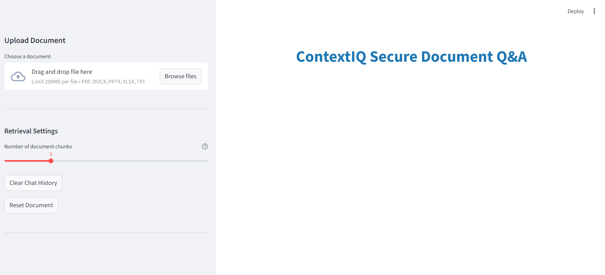
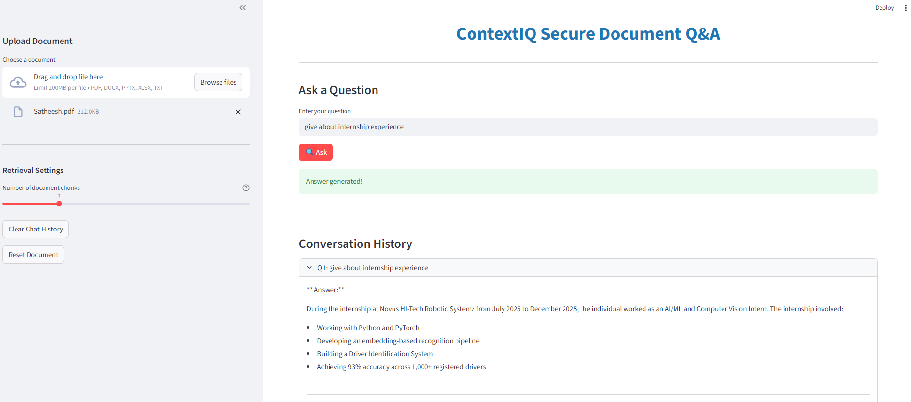

# ContextIQ - A Local RAG Based Secure Document Q&A System

ContextIQ is a fully local Retrieval-Augmented Generation (RAG) system that allows users to upload documents and ask AI-powered questions about their content — without using external APIs.
## Features

- **Multi-format Document Support**: PDF, Word (.docx), Excel (.xlsx), PowerPoint (.pptx), and Text (.txt)
- **Semantic Search**: Uses sentence transformers and FAISS for efficient vector similarity search
- **AI-Powered Answers**: Leverages OpenVINO LLM (Phi-3) for accurate question answering
- **Interactive UI**: Clean Streamlit interface with conversation history
- **Source Attribution**: Shows which document sections were used to generate answers

## Architecture

```
User Upload → Document Parser → Text Chunker → Embedding Generator
                                                        ↓
User Question → Query Embedder → FAISS Search → Context Retrieval → LLM → Answer
```

## Prerequisites

- Python 3.8+

## Installation

### 1. Clone the repository

```bash
git clone https://github.com/satheeshbhukya/ContextIQ.git
cd ContextIQ
```

### 2. Create virtual environment

```bash
python -m venv venv

# On Windows
venv\Scripts\activate

# On macOS/Linux
source venv/bin/activate
```

### 3. Install dependencies

```bash
pip install -r requirements.txt
```
### 4. Model download 
```bash
You must download OpenVINO Phi-3 model locally using python download_model.py
```

## Usage

### Run the application

```bash
streamlit run app.py
```

The app will open in your browser at `http://localhost:8501`

### Using the system

1. **Upload a document** using the sidebar file uploader
2. **Wait for processing** (you'll see a success message with chunk count)
3. **Ask questions** in the text input field
4. **View answers** with source attribution
5. **Check conversation history** to see previous Q&A pairs

## Project Structure

```
ContextIQ/
│
├── app.py
├── requirements.txt
├── README.md
├── .gitignore
│
├── scripts/
│   ├── document_parser.py
│   ├── text_processor.py
│   ├── vector_store.py
│   └── rag_engine.py
│
├── model/                ❌ NOT included in GitHub
│   └── phi-3-openvino/
│
└── data/                 (optional FAISS index storage)

```

## Configuration

### Adjustable Parameters

In the sidebar, you can adjust:
- **Number of chunks to retrieve** (1-10): More chunks = more context but slower

## Example Use Cases

1. **Research Papers**: Upload PDFs and ask about methodologies, findings, conclusions
2. **Legal Documents**: Query contracts, agreements for specific clauses
3. **Business Reports**: Extract insights from quarterly reports, presentations
4. **Technical Documentation**: Search for specific procedures, configurations
5. **Academic Notes**: Ask questions about study materials, lecture slides

## Technical Stack

- **Frontend**: Streamlit
- **Document Processing**: PyMuPDF, python-docx, python-pptx, pandas
- **Text Processing**: LangChain
- **Embeddings**: Hugging Face sentence-transformers (all-MiniLM-L6-v2)
- **Vector Store**: FAISS
- **LLM**: OpenVINO Phi-3
- 
## Flow Diagram

```
┌─────────────────────────────────────────────────────────┐
│  QUICK REFERENCE                                        │
├─────────────────────────────────────────────────────────┤
│  Start App:      streamlit run app.py                   │
│  Upload Doc:     Browse files → Select file             │
│  Ask Question:   Type → Click Ask                       │
│  Adjust Chunks:  Drag slider (1-10)                     │
│  Clear History:  Click "Clear Chat History"             │
│  New Document:   Click "Reset Document"                 │
│  Stop App:       Ctrl+C in terminal                     │
└─────────────────────────────────────────────────────────┘
```


## Demo





## License

MIT License - feel free to use this project for personal or commercial purposes.


## 📧 Contact

For questions or support, please open an issue on GitHub or contact [satheeshbhukyaa@gmail.com]

---

**⭐ If you find this project useful, please consider giving it a star!**
